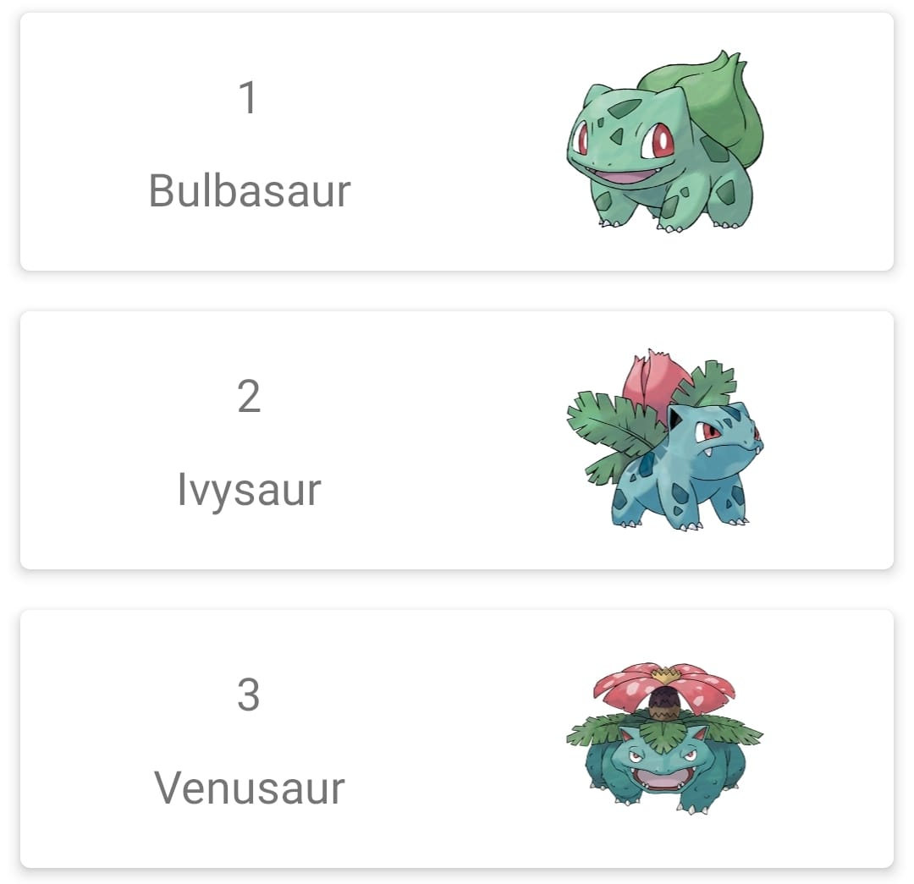

### Android Bootcamp Challenge

This is a challenge that needs to be solved in order to be an attendee in the Wizeline
Academy's Android Bootcamp! But don't worry, you won't face some complex algorithms nor
tricky questions about complexity. :) Instead, you'll have to solve a series of exercises
regarding the basic principles of the Android Development.

What we have here is a little Pokedex app (which uses the famous [PokeAPI](https://pokeapi.co/)).

The topics covered by the challenge are:

1. Android Layouts and UI

The `FeaturedPokemonFragment` contains a `RecyclerView` which will list some featured Pokemons
that are going to be showed to the user. You'll need to create the next UI for them in the
`item_featured_pokemon.xml` file!

You can use whatever you want to achieve this layout: `ConstraintLayout`, `LinearLayout`, or
even `RelativeLayout`.

As you can see, there are three main components:
- Pokemon ID
- Pokemon Name
- Pokemon Image

This fields can be bound to the layout in the `PokemonViewHolder.bind(Pokemon)` method. 

Tip 1: use `Glide` to load the images into the `ImageView`!

Tip 2: Right now, the whole project uses `View Binding` to set up views. However, you
can use whatever you want, including the classical `View` objects or even `Data Binding`.

2. Networking

When any item in our `ReyclerView` is clicked, the app will take us to the `PokemonDetailsFragment`,
which will make a network call to get all the details of the selected pokemon, and returning a
`PokemonDetails` object.

You'll need to implement this feature in the `PokemonDetailsRepo`, which uses a `PokemonDetailsService` 
interface, a `Retrofit` service. You'll need to hit the endpoint `pokemon/{id}` of the PokeAPI, using
`Retrofit` annotations. Keep in mind that a network call must be made out of the app main thread.
You can use Kotlin Coroutines, RxJava or any other solution to tackle this challenge.

Tip 1: [`Retrofit`](https://square.github.io/retrofit/) is one of the more preferred (if not the most)
ways of doing networking in Android. It's thread-safety, it supports RxJava and now coroutines. 

Tip 2: the project has [`Moshi`](https://github.com/square/moshi) set up to work along with `Retrofit`,
so there is no need to handle the JSON parsing mannually

3. Android Design Patterns and Architecture

Once the Network call is finished and successful, you'll need to arrange that data into the view
(i.e. the `PokemonDetailsFragment`). You can use the class `PokemonDetailsViewModel` to communicate
with the repo, and use `LiveData` to communicate with the fragment.

However, as with the rest of the challenge, you can use some other pattern you are comfortable with.
For example, MVP (Model-View-Presenter) is a good choice.

## Code Review Process

You'll receive this challenge as a zip file, with no git repo available. To start solving
the challenge, you'll need to follow the next steps:

1. When you receive the challenge, create a git repo to track their solutions (use the command `$ git init`).
2. Solve the challenges, creating a commit for every exercise.
3. When everything is ready, create a **private** repo on Github and push your code.
4. Add your mentor as a contributor, so they can check your code.
